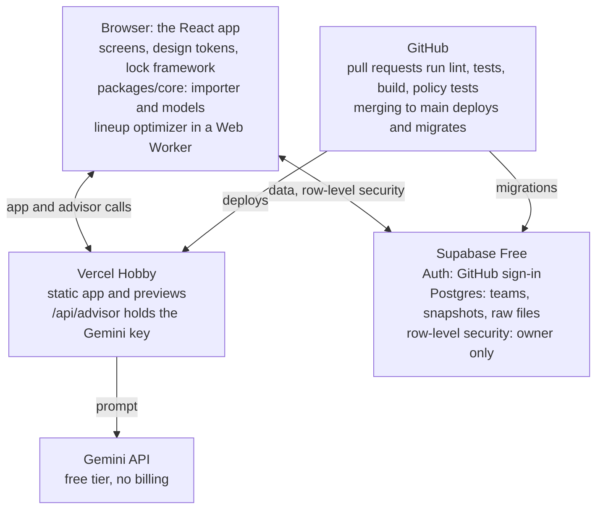

# OOTP CSV Consultation — Implementation Plan

> Exported from the Claude Doc on 3 October 2026. From here on, this file is the source of truth: change it in the same pull request as the work it describes.

## Scope

Platform work comes first: a deployed, signed-in walking skeleton with CI/CD and a database. Frontend coding starts in Phase 3, once that foundation and the importer exist. Everything runs on free plans for personal, non-commercial use.

This plan says what to build and in what order; it doesn't repeat the specs. Data, import rules and models live in `docs/agent-knowledge-base.md`, the spec of record, and Seattle's reference data in `docs/implementation-basis.md`. Screens and their states live in `docs/design-handoff.md` and `docs/design/boards/`.

Tasks are checkboxes to tick off as you go. Service limits were checked on 3 October 2026 and are linked where they're used.

## Platform decisions

GitHub Pages (the github.io address) and Vercel are two hosts for the same job, so the plan picks one. It uses Vercel, with GitHub for source control and CI. The deciding factor is the advisor, whose API key needs a server-side function that GitHub Pages can't run.

| Decision | Choice | Why | Status |
| --- | --- | --- | --- |
| Hosting | Vercel Hobby | Runs the advisor function and builds a preview URL for every pull request. Hobby is free for [non-commercial personal use](https://vercel.com/docs/limits/fair-use-guidelines). | Proposed |
| Source and CI | GitHub repo under your personal account, GitHub Actions | Vercel Hobby can't connect to repos owned by a [GitHub organization](https://vercel.com/docs/limits). | Proposed |
| Repo visibility | Public | On GitHub Free, public repos get [free Actions minutes](https://docs.github.com/en/billing/concepts/product-billing/github-actions), [branch protection](https://docs.github.com/en/repositories/configuring-branches-and-merges-in-your-repository/managing-protected-branches/about-protected-branches) and [environment secrets](https://docs.github.com/en/actions/reference/workflows-and-actions/deployments-and-environments). Private repos get 2,000 minutes a month and none of the rest. | Open |
| Database | Supabase Free (Postgres) | Row-level security lets the browser read and write directly, so there's no API layer to build. Browser-only storage would avoid a server but ties data to one device. | Proposed |
| Sign-in | Supabase Auth, GitHub as the only provider, sign-ups closed once your account exists | The URL is public; the data shouldn't be. | Proposed |
| Advisor model | Gemini API free tier, no billing account linked | Matches the wireframe and can't incur charges. Free-tier prompts may be used to [improve Google products](https://ai.google.dev/gemini-api/docs/billing), acceptable for fictional league data. | Proposed |
| Frontend stack | React, TypeScript and Vite, as a static single-page app | Static output deploys to Vercel or GitHub Pages unchanged. Heavy math runs in the browser, off the function quotas. | Proposed |

Publishing as a claude.ai artifact, the other free route in the design handoff, would skip this platform layer but keep the app inside claude.ai.

## Target architecture

The browser does the analysis; servers only store data and hold the advisor key.



The browser loads the app from Vercel and reads and writes Supabase directly, guarded by row-level security. Only advisor questions pass through a server function, because that's the one place a secret key is needed.

## Free-tier budget

Every service stays free because none has a payment method on file, so each stops at its limit instead of billing. Expected use is a small fraction of each allowance: a full snapshot of raw exports is about 17 KB of team views (18 KB with the hitter capture), plus about 170 KB of league files.

| Service | Limits that matter | Expected use | When a limit is hit |
| --- | --- | --- | --- |
| [Vercel Hobby](https://vercel.com/docs/limits/fair-use-guidelines) | 100 GB data transfer, 1M function invocations and 4 hours of Active CPU a month; [100 deployments a day, one build at a time](https://vercel.com/docs/limits) | A few deployments a day; advisor calls in the dozens | No on-demand billing on Hobby; usage over the allotment can pause the project |
| [Supabase Free](https://supabase.com/pricing) | 500 MB database, 1 GB file storage, 5 GB egress, 2 active projects; pauses after 1 week without activity; no automatic backups | About 5 MB of raw files a season at weekly snapshots | A paused project is resumed from the dashboard; the app shows a reconnect message |
| [GitHub Actions](https://docs.github.com/en/billing/concepts/product-billing/github-actions) | Public repo: standard runners free. Private repo: 2,000 minutes and 500 MB of artifacts a month | A few minutes per pull request | With no payment method on file, runs are blocked until the quota resets |
| [Gemini API free tier](https://ai.google.dev/gemini-api/docs/rate-limits) | Per-project rate limits, shown in AI Studio; the daily quota resets at midnight Pacific | One call per advisor question | Calls fail with a rate-limit error; the advisor says so and every other screen keeps working |

Check all four usage pages once a month. Limits change, and these were read on 3 October 2026.

## Repository layout and tooling

One pnpm monorepo holds the web app, a framework-free core package, the advisor function and the database migrations, so they version together. The core package has no DOM or network code, which makes every calculation testable in CI.

```text
ootp-consultation/
├── apps/web/                 React + Vite app (screens, design system)
│   └── api/advisor.ts        Vercel Function: the Gemini proxy
├── packages/core/            importer, metrics, models (pure TypeScript)
├── supabase/
│   ├── migrations/           SQL, applied by CI only
│   └── tests/                pgTAP policy tests
├── fixtures/
│   ├── seattle-g42/          team views, hitter capture, league files
│   └── legacy/               older superstats versions
├── e2e/                      Playwright specs
├── docs/adr/                 one record per decision
└── .github/
    ├── workflows/            ci.yml, db.yml, e2e.yml, keepalive.yml
    └── dependabot.yml
```

| Tool | Role |
| --- | --- |
| Node.js LTS, pnpm workspaces | Runtime and package manager; one lockfile |
| TypeScript, strict mode | One shared config for the app, core and function |
| Vite | Dev server and static build |
| ESLint, Prettier | Lint and format, enforced in CI |
| Zod | Validates parsed rows, settings and advisor payloads at runtime |
| Vitest | Unit and golden-fixture tests |
| Playwright with axe | End-to-end and accessibility tests |
| Supabase CLI | Migrations, generated database types, policy tests |

- [ ] Create the repo under your personal account, default branch `main`.
- [x] Scaffold the pnpm workspace: `apps/web` from the Vite React TypeScript template, `packages/core` as a library.
- [x] Add the shared strict tsconfig, ESLint, Prettier and `.editorconfig`.
- [x] Add Vitest at the workspace root with a coverage floor on `packages/core`.
- [x] Commit `.env.example`; gitignore `.env*.local`. It lives in `apps/web/`, where Vite reads env files.
- [ ] Write `docs/adr/0001-platform.md` once the decisions table is confirmed.
- [ ] Use Conventional Commits and squash merges, so `main` reads as one change per pull request.
- [x] Run tasks through CAO: the workspace manifests in `.workspace/`, the roles in `.cao/roles/`, the generated profiles in `.cao/agent_store/` and the launcher `.cao/bin/cao-task-launch`; `.cao/README.md` has the setup.

## Environments and configuration

Three environments run on two Supabase projects: local development and pull-request previews share staging, and only `main` touches production.

| Environment | Frontend | Database | Advisor key | Deployed by |
| --- | --- | --- | --- | --- |
| Local | `vercel dev` (Vite plus the advisor function) on localhost | Staging project | Staging key in `.env.local` | You |
| Preview | Vercel preview URL, one per pull request | Staging project | Staging key, Vercel Preview scope | Vercel, on every push to a pull request |
| Production | Vercel production URL | Production project | Production key, Vercel Production scope | Vercel, on every merge to `main` |

Local development points at the cloud staging project, not a local Supabase stack, so it never needs Docker. The full stack runs in CI instead.

| Variable | Set in | Visibility | Purpose |
| --- | --- | --- | --- |
| `VITE_SUPABASE_URL` | Vercel (Preview, Production), `.env.local` | Public, shipped to the browser | Project URL |
| `VITE_SUPABASE_PUBLISHABLE_KEY` | Vercel (Preview, Production), `.env.local` | Public by design; row-level security protects the data | Client key (publishable, formerly anon) |
| `GEMINI_API_KEY` | Vercel (Preview, Production), `.env.local` | Secret, server only | Advisor calls |
| `ADVISOR_DAILY_LIMIT` | Vercel | Server config | Caps advisor calls per day |
| `SUPABASE_ACCESS_TOKEN` | GitHub Actions secret | Secret | Lets CI run the Supabase CLI |
| `SUPABASE_DB_PASSWORD_STAGING`, `SUPABASE_DB_PASSWORD_PROD` | GitHub Actions secrets | Secret | Migration pushes |
| `SUPABASE_REF_STAGING`, `SUPABASE_REF_PROD` | GitHub Actions variables | Not secret | Which project CI targets |
| `SUPABASE_PUBLISHABLE_KEY_STAGING` | GitHub Actions variable | Public by design | The e2e workflow's dev server, with the staging URL built from `SUPABASE_REF_STAGING` |
| `E2E_EMAIL`, `E2E_PASSWORD` | GitHub Actions secrets | Secret | The staging test user the signed-in e2e tests use |

Two rules keep secrets out of the browser: a `VITE_` prefix means public, and no secret ever gets one. The app never needs Supabase's secret or service-role key, so none is stored anywhere.

- [x] Create Supabase projects `ootp-staging` and `ootp-prod`, the Free plan's two active projects.
- [ ] Create the two Gemini keys in separate AI Studio projects; [rate limits are per project](https://ai.google.dev/gemini-api/docs/rate-limits), so previews can't drain production's quota.
- [x] Enter the Vercel variables with Preview and Production scopes.
- [x] Enter the GitHub secrets at repository level; environment secrets need a public repo on GitHub Free.
- [ ] Keep `.env.example` in sync with this table.

## CI pipeline

A pull request merges only after lint, type checks, unit and golden tests, a production build and the database policy tests pass. GitHub Actions runs it all on hosted Ubuntu runners, which have the Docker that the Supabase stack needs.

| Workflow | Trigger | What it runs | Blocks merge |
| --- | --- | --- | --- |
| `ci.yml` | Every pull request and push to `main` | Install with a pnpm cache, lint, typecheck, Vitest with the core coverage floor, production build | Yes |
| `db.yml` | Pull requests touching `supabase/`; pushes to `main` | Start Supabase on the runner, apply every migration from scratch, run pgTAP policy tests; on `main`, push migrations to staging, then production | Yes, on pull requests |
| `e2e.yml` | Every pull request, from Phase 3 | Build, serve against staging, run Playwright and axe | Yes, from Phase 3 |
| `keepalive.yml` | Weekly schedule, or by hand | One read request to each Supabase project, to avoid the 1-week inactivity pause | No |
| `dependabot.yml` | Weekly | Grouped npm and GitHub Actions updates, each one a pull request through CI | Not a workflow |

- [ ] Set `concurrency` with `cancel-in-progress`, so a new push to a pull request cancels its previous run; pushes to `main` each keep their own run. Done in `ci.yml`; keep it in each new workflow.
- [ ] Give every job a unique name; [required checks match on job name](https://docs.github.com/en/repositories/configuring-branches-and-merges-in-your-repository/managing-protected-branches/about-protected-branches). Done in `ci.yml`; keep it in each new workflow.
- [ ] Pin third-party actions to a commit SHA. Done in `ci.yml`; keep it in each new workflow.
- [ ] Add a secret scan (for example gitleaks) to `ci.yml`.
- [ ] Protect `main` with a ruleset: pull request required, the three checks required, linear history. On GitHub Free this needs a public repo.
- [ ] Keep a pull-request run under five minutes, so private-repo minutes would also last.

## CD and release

Vercel deploys every pull request to its own preview URL and every merge to `main` to production. Database changes ship only through `db.yml`, never by hand from the dashboard.

1. Push a branch and open a pull request. Vercel builds a preview against staging and posts its URL; CI runs.
2. Check the preview. When the checks are green, squash-merge.
3. On `main`, Vercel builds production while `db.yml` applies pending migrations to staging, then production.
4. To roll back the app, promote the previous production deployment in Vercel. To roll back the database, ship a new forward migration; never edit one that has already run.

The two jobs in step 3 run in parallel, so every migration must work with both the old and the new app. Add columns and tables first, ship the code that uses them, then drop old ones in a later release.

- [x] Import the repo in Vercel: root directory `apps/web`, Vite preset, pnpm install from the workspace root, Node version pinned.
- [ ] Turn on pull-request comments in the Vercel GitHub integration.
- [ ] Add an Ignored Build Step so docs-only changes don't deploy; Hobby builds [one deployment at a time](https://vercel.com/docs/limits).
- [ ] Practice one rollback before Phase 3, while there's nothing to lose.
- [ ] Tag a release (`v0.1`, `v0.2`, and so on) at each phase exit.

## Database and auth

Raw export files are the source of truth: Postgres stores each file verbatim with its import log, and the browser recomputes everything else. The importer will change often, and re-reading raw files means no derived table ever needs a migration.

| Table | Key columns | Notes |
| --- | --- | --- |
| `teams` | `name`, `league`, `rating_scale`, `league_shows` (potentials only, or current and potential), `dh_enabled`, `games_per_season`, `dev_lab_slots` (1–30) | The Team setup fields from the design handoff |
| `snapshots` | `team_id`, `label` (`Game 42`), `game_number` | One per upload day; game number = most games played by any hitter |
| `view_files` | `snapshot_id`, `original_filename`, `detected_view`, `side`, `routing` (primary, supplemental, rejected), `content`, `sha256`, `importer_version` | Raw CSV kept as text; unique on snapshot plus hash, so a re-upload dedupes |
| `import_events` | `view_file_id`, `level`, `code`, `message`, `details` (JSON) | The import log: routing, players matched, header mappings, rejection reasons |
| `advisor_messages` | `snapshot_id`, `question`, `answer`, `citations` (JSON), `model` | Phase 5; also counts calls for the daily cap |

Every table also carries `id`, `owner_id` and `created_at`. The `supplemental` routing exists for the pitching view run on hitters: the importer keeps its DEF Pot column and drops the rest, instead of rejecting the file.

Row-level security is on for every table, with one policy shape: `owner_id = (select auth.uid())`, and `owner_id` defaults to the caller. Supabase Auth uses GitHub as the only provider. After your first sign-in, turn off new sign-ups so nobody else can create an account.

The Free plan has [no automatic backups](https://supabase.com/pricing). The app's Export team action downloads a zip of every raw file plus the team settings, and re-importing that zip is the restore.

- [x] Migration `0001`: the five tables, indexes on every foreign key and `owner_id`, row-level security enabled.
- [x] pgTAP tests per table: the owner can read and write; a second user and an anonymous caller see nothing.
- [x] Generate database types with the Supabase CLI; CI fails if they drift from the migrations.
- [x] Create a GitHub OAuth app per Supabase project; allow redirects for localhost, the preview URL pattern and production.
- [x] Turn off sign-ups on both projects after your first sign-in.
- [x] Store and load a team's snapshots: dated by game number, raw files kept verbatim with their import log, a re-export replacing its view and a later game adding history (Knowledge Base › Architecture › Module contracts, Team store).
- [x] Build Export team, plus a test that re-imports its zip, in Phase 2.

## Advisor service

One function, `/api/advisor`, holds the Gemini key. The browser sends a question plus facts the app has already computed, and the function returns an answer that cites those facts by ID.

1. The browser builds a fact list from the current snapshot: player lines, model outputs with their confidence, and flags for missing data such as platoon splits.
2. It calls `/api/advisor` with your Supabase access token.
3. The function rejects the call unless the token is valid and today's count is under `ADVISOR_DAILY_LIMIT`.
4. It sends the system prompt, the facts and the question to Gemini, then validates the reply against a schema.
5. It stores the exchange in `advisor_messages` and returns the answer, its citations and any missing-data notes.

The system prompt carries the design handoff's contract. Answers cite the numbers they use, say when data is missing and never invent a rating. They also keep data coverage and estimate confidence apart.

Hobby functions can run for [300 seconds](https://vercel.com/docs/functions/limitations), and time spent waiting on the model doesn't count toward Active CPU. Request and response bodies cap at 4.5 MB, far above a snapshot's fact list.

`packages/core` exports its TypeScript source with no build step, which Vite bundles for the browser. Vercel's Node builder doesn't: a function that imports runtime values from `@ootp/core` builds green and then fails with `ERR_MODULE_NOT_FOUND`. Until core gets a JavaScript build, the function uses `import type` only. A Vercel build also doesn't fail on a function's type errors, so `api/` needs its own tsconfig (Node types, no DOM) referenced from the root `tsconfig.json`.

- [ ] Define an `AdvisorProvider` interface with one Gemini implementation, so another model can swap in without touching the UI.
- [ ] Set `maxDuration` to 60 seconds, with a matching client timeout.
- [ ] Map Gemini's rate-limit error to a "quota reached for today" state; every other screen keeps working.
- [ ] Test against recorded model replies, so CI never calls the real API.
- [ ] Log token counts per call, to see how close daily use runs to the free-tier limits.

## Core logic package

`packages/core` holds every calculation as pure TypeScript, built in the order of Knowledge Base › Delivery plan. Only the importer and canonical tables must exist before frontend work starts; each model arrives with the screen that shows it.

| Order | Module | Spec in the Knowledge Base | First screen that needs it | Phase |
| --- | --- | --- | --- | --- |
| 1 | Importer: header detection, synonym table, unit and enum normalization, identity checks, routing | Import contract (§ 5) | Create a Team, Clubhouse | 2 |
| 2 | League file import: name joins and duplicate flags | Data sources (§ 4); Import contract › Joins and snapshots (§ 5) | Clubhouse (league upload not yet designed) | 2 |
| 3 | Canonical tables and league config, stored on 20–80 | Ratings model › Scale conversion (§ 7) | Every screen | 2 |
| 4 | Metrics and luck gaps | Metrics and league context (§ 6) | Talent radar, Bullpen & tactics | 4 |
| 5 | League percentiles | League percentiles (§ 8) | Talent radar | 4 |
| 6 | Talent estimator v0 | Ratings model › Talent estimator (§ 7) | Talent radar, Lineup card | 4 |
| 7 | Defensive model and eligibility matrix | Defensive model (§ 9) | Lineup card | 4 |
| 8 | Strategy rules engine | Strategy rules (§ 10) | Bullpen & tactics | 4 |
| 9 | Lineup optimizer, in a Web Worker | Lineup optimization (§ 11) | Lineup card | 4 |
| 10 | Development planner | Development planner (§ 12) | Dev lab | 4 |
| 11 | Consultation output and the manager's card | Product vision and scope (§ 2) | Every screen, advisor | 4–5 |
| 12 | Backtest | Delivery plan (§ 15) | Trends | 6 |

These acceptance criteria differ from the canvas or from the Basis as written; the Knowledge Base already includes them:

- The pitching view run on hitters routes as supplemental and keeps DEF Pot; it isn't rejected.
- Each luck comparison gets its own baseline from the import. Seattle's BACON runs below xBACON, yet team wOBA runs .008 above xwOBA and staff ERA 0.15 above xERA.
- Regression signals come from the estimator (FIP, SIERA, ratings), with xERA as one input.
- Small-sample flags use each stat's stabilization point, not one innings cutoff.
- Pitcher age comes from `cus_pitch_pot`.
- At a non-listed position, position cards show component ceilings, not the listed position's DEF.

- [x] Add the six canonical uploads to `fixtures/seattle-g42/`: `custom_bat_pot`, `cus_pitch_pot`, the hitter capture and the newer `batting_superstats_1`, `pitching_superstats_1` and `pitching_superstats_2`.
- [x] Add the four league sortable superstats exports to `fixtures/seattle-g42/` (Knowledge Base › Data sources › League sortable stats).
- [x] Keep the older superstats copies in `fixtures/legacy/`, to test header-version handling.
- [x] Detect each export's view and header version from its header row, with every version in the header manifest (Knowledge Base › Import contract › Header manifest).
- [x] Route each export: read the CSV and file name, and route it as primary, supplemental or rejected, with its scope, side and import events (Knowledge Base › Import contract).
- [x] Validate a snapshot across its files: names and positions, repeated columns, identities, the rating scale and league rows (Knowledge Base › Import contract › Invariants).
- [x] Stamp every import with `importer_version`, so re-reading raw files is deterministic.
- [x] Convert ratings between the league's display scale and 20–80 (Knowledge Base › Ratings model › Scale conversion).
- [x] Assemble a snapshot: one player table per side with ratings on 20–80, the league tables, validation events and the Game N label (Knowledge Base › Import contract › Joins and snapshots).
- [x] Import the league sortable files: name joins, duplicate flags, rows with G = 0 dropped (Knowledge Base › Import contract › Joins and snapshots).
- [x] Build metrics and luck gaps: exported metrics passed through, BACON and xFIP computed, luck gaps against each pair's team baseline, and small-sample flags from stabilization points (Knowledge Base › Metrics and league context).
- [x] Build league percentiles: usage-based peer pools, sample floors, metric directions and the mid-rank formula (Knowledge Base › League percentiles).

## Frontend foundation

Frontend coding starts with what every screen shares: design tokens, the app shell, routing, data loading and a lock framework for missing data. The first screens built on it are the Team menu, the three-step Create a Team flow and the Clubhouse.

| Piece | What gets built |
| --- | --- |
| Design tokens | The handoff's palette as CSS variables (navy `#0A1118`, slate `#121D24`, chalk `#F5F7FA`, gold `#E5A93C`, crimson `#D9534F`, emerald `#2ECC71` and the rest); Chakra Petch for UI text and IBM Plex Mono for numbers, both self-hosted |
| Component rules | Emerald ▲ and crimson ▼ always carry the arrow; a dashed gold outline means empty; locked features stay visible with a lock and name what unlocks them; 44 px minimum targets |
| App shell | Top bar with team, league, snapshot selector (previous and next), data-coverage badge, DH and advisor status; tabs for Clubhouse, Talent radar, Lineup card, Bullpen & tactics and Dev lab |
| Routing | `/sign-in`, `/teams`, `/teams/new`, `/t/:team/settings`, and `/t/:team/s/:snapshot/` plus one path per tab |
| Data loading | TanStack Query over Supabase; derived data computed by `packages/core` and cached per snapshot and importer version |
| Lock framework | Each module declares the data sets it needs; a shared wrapper renders the locked state and names the export that unlocks it, so no screen ever breaks. Tabs whose screens arrive in Phase 4 render the same locked state, naming the phase |
| Styling | Plain CSS: the tokens as custom properties in three layers (primitive, semantic, component), CSS Modules per component, no utility framework. A test fails on a raw color outside the token file. Motion is CSS transitions that respect `prefers-reduced-motion`; React 19.3 ships `ViewTransition`, for the setup steps and Suspense reveals where motion carries meaning |
| Data coverage | A `packages/core` module: each player's five data sets (bio, stats, batted ball, swing decisions, ratings), the team badge, what to upload next, and the view descriptions the screens show. League files count separately |
| Vocabulary | "Data coverage" is the top-bar badge (Low, Moderate, High). "Estimate confidence" is the band on a recommendation. |

The canvas's Dugout alignment, batting order and luck reads are placeholders, so they get built from the models, not copied. Talent radar with its league percentiles, the situational strategy view, trends and the league-file upload still need designs before Phase 4 reaches them. Until the league upload is designed, league files go through the same drop zones as team views and show up in the import log.

Build order, one pull request each:

- [x] Design tokens, self-hosted fonts and a component sheet page (`/sheet`), checked against the canvas. A test keeps raw colors out of components.
- [x] Routing, the sign-in screen, data loading with TanStack Query over the Supabase store, and an error boundary per screen. The Playwright and axe harness lands here too, so every later screen ships with its tests.
- [x] Data coverage in `packages/core`, with tests on the fixtures: the Seattle snapshot is High with 12 hitters at 5 of 5 data sets and 13 pitchers at 4 of 5 (no pitcher bio view).
- [x] App shell: top bar (team menu, snapshot selector, coverage badge, DH, advisor status), module tabs with locked states, and the lock framework.
- [x] Team menu and Create a Team: add exports (drop or choose files, folders included), files read, team and league prefilled from the files, review, create.
- [x] The Clubhouse: upload, snapshot timeline, what to upload next, coverage matrices, import log, how columns were read, Run analysis.
- [x] Team settings, Export team and restore from a zip.
- [x] End-to-end and accessibility tests in `e2e.yml`: Create a Team from the fixtures yields a Game 42 snapshot with High coverage; locked states render; no serious axe violations; 44 px targets. The signed-in test runs as the staging test user below.
- [ ] Ask the design chat for Talent radar (with league percentiles), the situational strategy view, trends and where league files are uploaded. The brief is `docs/design/design-ask-phase-4.md`; sending it is the owner's step.

Phase 3.1 (v3.1), from the owner's Phase 3 review on 5 October 2026:

- [x] Update exports after setup: add or update exports from any team screen, including a team with no snapshot yet; remove or replace a single file in Create a Team and in the Clubhouse, with each file's outcome listed; team settings without Dev Lab slots or the ratings-shown choice (potentials only, for now); Best first upload without the bio view.
- [ ] Retire `teams.dev_lab_slots`, which the app stopped using in v3.1: make the column nullable in one release, stop writing it in the next, then drop it. Needs the owner's go, since it changes production's schema.

## Testing and quality

The Seattle game-42 exports are the golden fixtures: every parser rule, identity check and model output is tested against them. Each row of the Knowledge Base's "Columns that need special handling" table becomes at least one test; that table is the checklist.

| Layer | Tool | What it proves | Runs |
| --- | --- | --- | --- |
| Unit and golden | Vitest | Parse rules (innings as outs, percent strings, salary, contract years, handedness), header detection, synonyms, identities such as RV = RV-FB + RV-BR + RV-OFF | Every pull request |
| Fixture variants | Vitest | Legacy superstats copies import with a version warning; the hitter capture routes as supplemental; an unrecognized or mismatched file is rejected with a reason | Every pull request |
| Database policies | pgTAP through the Supabase CLI | Owner-only access on every table; anonymous callers see nothing | Pull requests touching `supabase/` |
| End-to-end | Playwright | Create a Team from the fixtures yields a Game 42 snapshot with the right coverage; locked states render | Every pull request, from Phase 3 |
| Accessibility | axe inside Playwright | No serious violations; 44 px targets | Every pull request, from Phase 3 |
| Performance | Vitest bench | The optimizer finishes inside its Web Worker within a budget set in Phase 4 | From Phase 4 |

End-to-end tests can't click through GitHub sign-in. Staging gets one email-and-password test user, with its credentials stored as GitHub secrets; production stays GitHub-only.

- [x] Write the test for each special-handling row before the parser code for it.
- [x] Run the identity checks as property tests over every fixture, skipping pitcher rows with G = 0, which carry no data.
- [x] Create the staging test user and store its credentials as secrets.
- [ ] Set the coverage floor on `packages/core` at 80% and raise it as modules settle. The 80% floor is set in `vitest.config.ts`.

## Operations

Operations stay small: keep Supabase awake, see errors, keep dependencies current, keep secrets out of git, and hold a backup you can restore.

| Concern | Approach |
| --- | --- |
| Supabase's 1-week inactivity pause | `keepalive.yml` makes a weekly read request to each project. In a public repo, GitHub [disables scheduled workflows](https://docs.github.com/en/actions/how-tos/manage-workflow-runs/disable-and-enable-workflows) after 60 days without repo activity, so re-enable it after a long break. If a project still pauses, resume it from the dashboard. |
| Errors | An error boundary per screen, plus Vercel runtime logs, which Hobby keeps for [1 hour](https://vercel.com/docs/limits). Add a free error tracker later if that proves too short. |
| Backups | Export team after each upload session; a restore is a re-import. |
| Dependencies | Dependabot opens grouped weekly pull requests; CI decides whether they merge. |
| Secrets | `.env*.local` ignored, a secret scan in CI, and the Gemini key only in Vercel. Rotate any key the moment it shows up anywhere else. |
| Cost | No payment method on Vercel, Supabase, GitHub or Google AI Studio, so nothing can bill. |
| Usage | Check the four usage pages monthly against the free-tier budget above. |

- [x] Add `keepalive.yml` in Phase 1, before the first idle week.
- [x] Add the error boundary and a not-found route in Phase 1.
- [ ] Set a monthly calendar reminder for the usage check and an export.

## Phases and exit criteria

Frontend coding starts in Phase 3, after the platform and data foundation. A phase ends when its gate passes, not when every box above is ticked.

| Phase | Scope | Exit gate |
| --- | --- | --- |
| 0. Decisions and accounts | Confirm the decisions table; open GitHub, Vercel, Supabase and AI Studio | Decisions confirmed or knowingly left open; four accounts, none with a card on file |
| 1. Walking skeleton | Repo, CI, Vercel deploys, GitHub sign-in; two Supabase projects, migration 0001 | Sign in on production, save and reload a team; a pull request shows green checks and a preview |
| 2. Data foundation | Importer for the team views and the league files, golden fixtures, full policy tests; upload, import log and Export team | The 11 Seattle files make a Game 42 snapshot; the hitter capture routes as supplemental; the four league files load |
| 3. Frontend foundation | Tokens, shell, routing, lock framework; Team menu, Create a Team, Clubhouse | Setup and Clubhouse match the canvas on real data; end-to-end and accessibility tests pass |
| 4. Models and screens | Metrics, percentiles, estimator, defense, strategy, optimizer, development; each with its screen | Every screen shows model output with evidence and confidence; no placeholders left |
| 5. Advisor | Advisor function, prompt contract, daily cap; manager's card export | Answers cite snapshot numbers and name any missing data |
| 6. Trends and backtest | Snapshot comparisons and trend views; backtest against later exports | A second snapshot shows trends; the backtest scores the Game 42 projections |

Phase 1, in order:

- [ ] Create the GitHub repo under your personal account.
- [x] Scaffold the workspace and push `ci.yml`; get the first green run.
- [x] Import the repo into Vercel and confirm a preview on a test pull request.
- [x] Create the two Supabase projects and turn on GitHub sign-in for each.
- [x] Add migration `0001` (all five tables and their policies) with `db.yml` to test and apply it.
- [x] Enter the Supabase variables in Vercel and `.env.local`.
- [x] Build one page that signs in, saves a team and reloads it.
- [ ] Add `keepalive.yml`, the error boundary and the `main` ruleset. `keepalive.yml`, the error boundary and the not-found page are in; the ruleset is a repository setting for the owner.
- [x] Close sign-ups on both projects and tag `v0.1`.

## Risks and open questions

The biggest risk is a quiet failure on a free tier, so each mitigation either keeps the app portable or keeps it working with a piece missing.

| Risk | Effect | Mitigation |
| --- | --- | --- |
| Supabase pauses a project | Saved teams don't load | Weekly keepalive, a clear reconnect message, Export team as a fallback |
| A free tier changes its terms | A service stops being free | Portable stack: static build, plain Postgres SQL, raw files as the source of truth. GitHub Pages, another Postgres host or browser storage can each take over one piece. |
| Gemini's free-tier limits or terms change | No advisor | The advisor is optional; every screen works without it, and the provider interface allows a swap |
| Vercel and the migration job race on merge | A brief mismatch between app and schema | Backward-compatible migrations only |
| The canonical uploads stay missing | The importer is tested on the wrong file versions | Resolved: all six are in `fixtures/seattle-g42/` |
| Docker isn't available for local development | No local database | Develop against staging; the Docker stack runs in CI |

- [ ] Public or private repo? This decides branch protection, environment secrets and Actions minutes.
- [ ] What address do you want: the free vercel.app one, a github.io one, or a custom domain?
- [ ] Do you need the app on more than one device? If not, browser storage could replace Supabase.
- [ ] Gemini for the advisor, or another model?

League questions are settled: the league uses the DH, and every export is OSA's view, since the scouting staff is disabled. Per-position ratings aren't available.

## Sources

All read on 3 October 2026.

- [Vercel: Limits](https://vercel.com/docs/limits)
- [Vercel: Fair Use Guidelines](https://vercel.com/docs/limits/fair-use-guidelines)
- [Vercel: Functions Limits](https://vercel.com/docs/functions/limitations)
- [Supabase: Pricing](https://supabase.com/pricing)
- [GitHub: Actions billing](https://docs.github.com/en/billing/concepts/product-billing/github-actions)
- [GitHub: About protected branches](https://docs.github.com/en/repositories/configuring-branches-and-merges-in-your-repository/managing-protected-branches/about-protected-branches)
- [GitHub: Deployments and environments](https://docs.github.com/en/actions/reference/workflows-and-actions/deployments-and-environments)
- [GitHub: Disabling and enabling a workflow](https://docs.github.com/en/actions/how-tos/manage-workflow-runs/disable-and-enable-workflows)
- [Gemini API: Rate limits](https://ai.google.dev/gemini-api/docs/rate-limits)
- [Gemini API: Billing](https://ai.google.dev/gemini-api/docs/billing)
